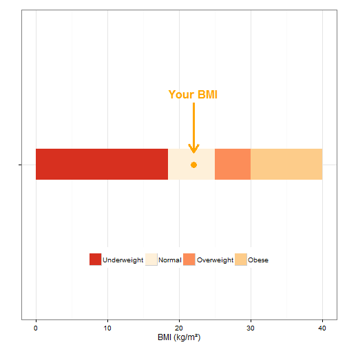

Body Mass Index Calculator
========================================================
author: Fabio Correa Didone
date: 13/03/2015 

BMI
========================================================


- The BMI is a number calculated from a person's weight and height.   


- BMI is used as a screening tool to identify possible weight problems for adults.  


- To determine if excess weight is a health risk, a _healthcare provider would need to perform further assessments._ 

Calculation
========================================================

- The formula to calculate the BMI is:  
 ${weight}/{height}^{2}$
 
- The results are given in kg/m2
- This table show how to basic interpret the results of BMI:
 

|Status      |BMI     |
|:-----------|:-------|
|Underweight |< 18.5  |
|Normal      |18.5-25 |
|Overweight  |25-30   |
|Obese       |> 30    |

Source: http://www.cdc.gov/healthyweight/assessing/bmi/adult_bmi/


The APP
========================================================

Two set of unit:

- Metric - **centimeters and kilograms** 
- Imperial: - **feet and pounds**.


```r
BMI <- function(weight,height,units)  { 
        if(units == "metric") {
                round(weight/(height/100)^2,2)->temp1
                temp1}
        else if(units == "imperial"){
                round((weight/(height*12)^2)*703,2)-> temp1
                temp1}}
```

Plot
===

- The app also plots a graph of where are your BMI in the scale of the BMI.
- The  code for the graph for a BMI of 22.

 


**Hope you guys enjoy it!** 

-
